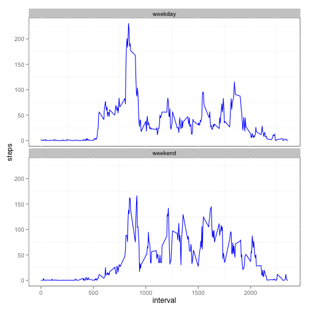

# Reproducible Research: Peer Assessment 1


## Loading and preprocessing the data

```r
data = read.csv("activity.csv", colClasses=c("numeric", "Date", "numeric"))
```


## What is mean total number of steps taken per day?
Here is a histogram of the total number of steps taken each day.

```r
total_steps=aggregate(steps ~ date, data, sum)
hist(total_steps$steps)
```

 

The mean and median total number of steps taken per day is 10766 and 10765, respectively.

## What is the average daily activity pattern?
From the following chart, we can see that in average people are active between 6:00 and 21:00.

```r
interval_steps = aggregate(steps ~ interval, data, mean, rm.na=TRUE)
with(interval_steps, plot(interval, steps, type="l", xlab="Time"))
```

 

People are most active at interval 835.

## Imputing missing values
The total number of missing values in the dataset is 2304.

Fill up the missing values with mean for that 5-minute interva.

```r
fixed_na = merge(data, interval_steps, by.x="interval", by.y="interval", all.x=TRUE)
fixed_na$steps = sapply(as.numeric(row.names(fixed_na)), function(index) {
    with(fixed_na, ifelse(is.na(steps.x[index]), steps.y[index], steps.x[index]) )
})
```

Create a new dataset that is equal to the original dataset but with the missing data filled in.

```r
fixed_na = fixed_na[c("steps", "date", "interval")]
```

Here is a histogram of the total number of steps taken each day.

```r
total_steps=aggregate(steps ~ date, data, sum)
hist(total_steps$steps)
```

 

The mean and median total number of steps taken per day is 10766 and 10765, respectively. Comparing to the original one, we can see the the impact of missing data is very minor.

## Are there differences in activity patterns between weekdays and weekends?

Create a new factor variable in the dataset with two levels – “weekday” and “weekend” indicating whether a given date is a weekday or weekend day.

```r
fixed_na$flag = as.factor(ifelse(weekdays(fixed_na$date) %in% c("Saturday", "Sunday"), "weekend", "weekday"))
```

Through the chart below, we can see that people start active in weekend later than in weekday probably because they wake up later, but are more active after 9 AM.

```r
library(ggplot2)
a = aggregate(steps ~ interval + flag, fixed_na, mean, rm.na=TRUE)
qplot(interval, steps, data=a, geom="line", colour=I("blue")) + 
    facet_wrap( ~ flag, nrow=2) + 
    theme(panel.background = element_rect(fill='white', colour='black'))
```

 
